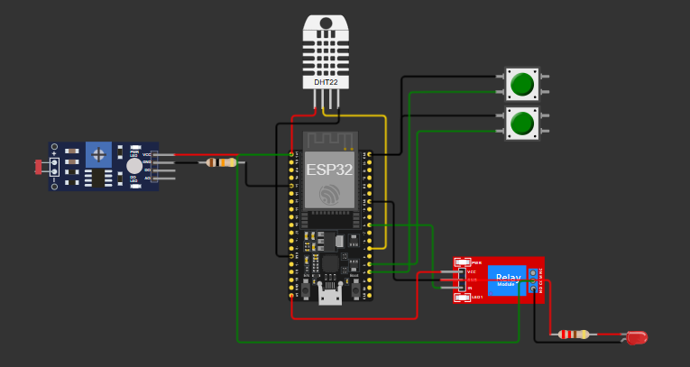
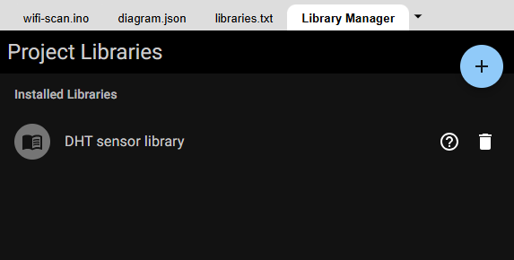

# FIAP - Faculdade de Informática e Administração Paulista

 

#🌾 Projeto de Sistema de Irrigação Inteligente - FarmTech Solutions

# Nome do Projeto
Fase 3 - Cap 1 - Construindo uma Máquina Agrícola

## Nome do grupo
Grupo 47

## 👨‍🎓 Integrantes: 
- <a href="https://www.linkedin.com/in/">Ana Beatriz Duarte Domingues</a>
- <a href="https://www.linkedin.com/in/jrsilva051/">Junior Rodrigues da Silva</a>
- <a href="https://www.linkedin.com/in/">Carlos Emilio Castillo Estrada</a>

## 👩‍🏫 Professores:
### Tutor(a) 
- <a href="https://www.linkedin.com/company/inova-fusca">Lucas Gomes Moreira</a>
### Coordenador(a)
- <a href="https://www.linkedin.com/company/inova-fusca">André Godoi Chiovato</a>

## 📜 Descrição

O objetivo principal é otimizar o uso da água em uma lavoura, através do monitoramento das condições do solo e da ajustagem automática da irrigação conforme necessário. Para isso, utilizamos um ESP32 integrado a sensores simulados no Wokwi, responsáveis por medir a umidade do solo, os níveis de nutrientes e o pH.  O sistema armazena os dados coletados em um banco de dados SQL para manter o histórico de leituras e controlar o acionamento de uma bomba d’água, representada por um relé.

Componentes do sistema:

Sensores e Atuadores:
* Microcontrolador ESP32: Gerencia as leituras dos sensores e controla a irrigação.
* Botões: Representam sensores de nutrientes (um botão para Fósforo e outro para Potássio).
* LDR (Light Dependent Resistor): Simula a leitura do pH do solo.
* DHT22: Sensor de umidade para monitorar a umidade do solo.
* Relé: Representa a bomba d'água para irrigação, ligando e desligando conforme a necessidade.

Banco de Dados SQL:
Armazena os dados dos sensores e conserva o histórico de irrigação para consulta e análise. A conexão com o banco de dados é realizada através de Python, utilizando operações CRUD para monitorar as condições do solo e aprimorar a irrigação.

## ⚙️ Estrutura do Circuito

  

  <strong>Figura 1:</strong> Estrutura do Circuito

## Simulação em Execução

  

  <strong>Figura 2:</strong> Simulação em Execução com Leitura dos Sensores

## Bibliotecas do Projeto

  

  <strong>Figura 3:</strong> Bibliotecas do Projeto no Wokwi

## 📁 Estrutura de pastas

Dentre os arquivos e pastas presentes na raiz do projeto, definem-se:

- <b>.github</b>: Nesta pasta ficarão os arquivos de configuração específicos do GitHub que ajudam a gerenciar e automatizar processos no repositório.

- <b>assets</b>: aqui estão os arquivos relacionados a elementos não-estruturados deste repositório, como imagens.

- <b>config</b>: Posicione aqui arquivos de configuração que são usados para definir parâmetros e ajustes do projeto.

- <b>document</b>: aqui estão todos os documentos do projeto que as atividades poderão pedir. Na subpasta "other", adicione documentos complementares e menos importantes.

- <b>scripts</b>: Posicione aqui scripts auxiliares para tarefas específicas do seu projeto. Exemplo: deploy, migrações de banco de dados, backups.

- <b>src</b>: Todo o código fonte criado para o desenvolvimento do projeto ao longo das 7 fases.

- <b>README.md</b>: arquivo que serve como guia e explicação geral sobre o projeto (o mesmo que você está lendo agora).

## 🔧 Como executar o código

# Pré-requisitos
* ESP32 configurado no simulador Wokwi para testes dos sensores.
* Python e bibliotecas como mysql-connector-python para integração com o banco de dados.
* Banco de Dados SQL configurado localmente ou na nuvem para armazenar dados dos sensores.

# Código Fonte
O código foi dividido em duas partes principais:
- **ESP32 (C/C++)**: Responsável pela leitura dos sensores e controle do relé. O código pode ser encontrado em `ESP32/codigo_esp32.ino`.
- **Python**: Inclui scripts para CRUD e visualização dos dados (opcional). O arquivo `Python/crud.py` contém a lógica de armazenamento em um banco de dados SQL.

# Passo a Passo para Execução
Fase 1 - Simulação e Configuração de Sensores:
* Abra o Wokwi.com e importe o código do ESP32, disponível na pasta src/esp32_code.
* Conecte os sensores simulados (Botões para P e K, LDR para pH, DHT22 para umidade) e o relé.
* Execute a simulação e observe o comportamento dos sensores e do relé.
  
ou, acesse o link disponibilizado no arquivo 'link_projeto_wokwi'.

Fase 2 - Configuração do Banco de Dados:
* Configure o banco de dados SQL usando a modelagem da fase anterior.
* Conecte o banco de dados ao código Python.
* No terminal, execute o código para fazer a criação de tabelas e realizar as operações CRUD.

## 🗃 Histórico de lançamentos
    * 
* 0.1.0 - 06/10/2024
    *

## 📋 Licença

<a property="dct:title" rel="cc:attributionURL" href="https://github.com/agodoi/template">MODELO GIT FIAP</a> por <a rel="cc:attributionURL dct:creator" property="cc:attributionName" href="https://fiap.com.br">Fiap</a> está licenciado sobre <a href="http://creativecommons.org/licenses/by/4.0/?ref=chooser-v1" target="_blank" rel="license noopener noreferrer" style="display:inline-block;">Attribution 4.0 International</a>.

